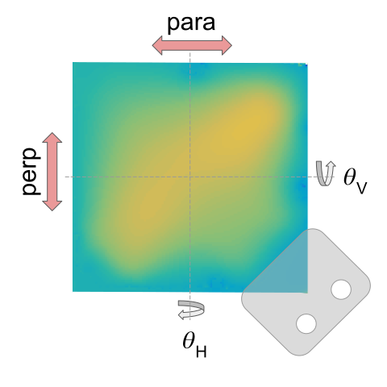

# spotfinder
**web application for visualization of coherent bremsstrahlung beam properties**

One commonly used method for producing beams of high-energy photons (gamma rays) is to accelerate electrons to high energy and pass them through a material
target. The radiation emitted by the electrons, known as bremsstrahlung, is normally either circularly polarized (if the electrons are longitudinally
polarized) or unpolarized. A third option, linear polarization, is also available if the target ("radiator") is an oriented crystal. The radiation of a
photon from a high-energy electron passing through a crystal is known as "coherent bremsstrahlung", which has been extensively studied by theoretically
and experimentally [1-5]. At sufficiently high electron energies, a coherent bremsstrahlung beam can be produced with nearly ideal properties: high
intensity, monochromatic, and higly polarized. Operating a high-energy photon source that achieves all three of these ideal properties presents a number
of challenges, particularly related to the type and quality of the crystal. The crystal must be as thin as possbile to reduce the effects of multiple
scattering of the electron beam, but thick enough to produce sufficient photon intensity given the limits of the electron beam current imposed by beam
heating and radiation damage to the crystal. The crystal must be a nearly perfect single crystal with good thermal conductivity made from a material
with low atomic number to reduce the background from the incoherent bremsstrahlung process that is always present. Incoherent bremsstrahlung produces a 
low-energy background that is neither monochromatic nor polarized, and degrades the properties of the coherernt bremsstrahlung beam. This combination of
proprties makes **single-crystal diamond** a unique choice for a high-energy coherent bremsstrahlung source. Below is an image of a single-crystal diamond
radiator mounted for use in the coherent bremsstrahlung beamline in Hall D at Jefferson Lab. 

  

### X-ray topograhs ###
The above false-color image is an example of what is known as a crystal X-ray topograph. Displayed in the composite graphic is a 7mm x 7mm single-crystal
diamond that has been polished down to a final thickness of just 50 microns (um) and attached n the lower right corner with conductive epoxy to an aluminum
mounting tab. In spite of being so thin, the rigidity and thermal conductivity of diamond is sufficient to make such a target self-supporting and self-cooled
when inserted into a high-energy electron beam. The color in the image represents an elevation map of one of the planes in the diamond crystal, ranging from
low (blue) to high (yellow) relative to an ideal plane aligned with the crystal at three of its corners. The total displacement from low to high in this
image is only 600 nm, but this slight imperfection is enough to significantly distort the properties of the coherent bremsstrahlung beam produced by the
diamond by 12 GeV electrons.

The above image was produced from the combined analysis of two other images known as "X-ray rocking-curve" topographs.
Rocking curves are measured by placing a crystal in an monochromatic X-ray beam and rotating (rocking) the crystal through a very small angular range
around one of the Bragg diffraction peaks of the crystal. As you rotate the crystal around the axes shown in the figure, either &theta;H or
&theta;V, different parts of the crystal reach a diffraction maximum at slightly different values of the rocking angle because of distortions
of the crystal structure arising from local defects and distributed strain (plastic deformation). Measuring the angle &theta;H or
&theta;V of the diffraction maximum for every pixel taken with a high-resolution X-ray camera and plotting the result as a false-color image
produces a rocking-curve topograph for one set of crystal planes. A pair of rocking curve topographs, one for &theta;H and the other for
&theta;V provides complete information about the "tilt" of the crystal planes away from the ideal. One such pair of rocking curves was used
to generate the elevation map of the crystal shown above.

## references ##
[1] G. Diambrini-Palazzi, "High-Energy Bremsstrahlung and Electron Pair Production in Thin Crystals", Revs. Mod. Phys. vol 40 (1968) p. 611.  
[2] U. Timm, "Coherent bremsstrahlung of electrons in crystals", Fortschr. Phys. vol. 17 (1969) p. 765.  
[3] "Coherent Radiation Sources", edited by A. W. Såenz and H. Uberall, Springer-Verlag, Berlin, 1985.  
[4] W. Kaune, G. Miller, W. Oliver, R.W. Williams, and K.K. Young, "Inclusive cross sections for pion and proton production by photons using collimated coherent bremsstrahlung", Phys. Rev. vol 11-3 (1975) pp. 478-494.  
[5] H. Bilokon, G. Bologna, F. Celani, B. D'Ettorre Piazzoli, R. Falcioni, G. Mannocchi, and P. Picchi, "Coherent bremsstrahlung in crystals as a tool for producing high energy photon beams to be used in photoproduction experiments at CERN SPS", Nuclear Inst. and Meth. 204 (1983), pp. 299--310.  
[6] G. Yang, R.T. Jones, F. Klein, K. Finkelstein, K. Livingston, “Rocking Curve Imaging for Diamond Radiator Crystal Selection”, Journal of Diamond & Related Materials 19 (2010) 719.  
[7] K. Finkelstein, R.T. Jones, A. Pauling, D.C. Sagan, Z. Brown, and D S. Misra, “High Resolution, Monochromatic X-ray Topography Capability at CHESS”, Proceedings of the 12th International Conference on Synchrotron Radiation Instrumentation (SRI-2015),  AIP Conf. Proc. 1741(2016) , 010001.  
